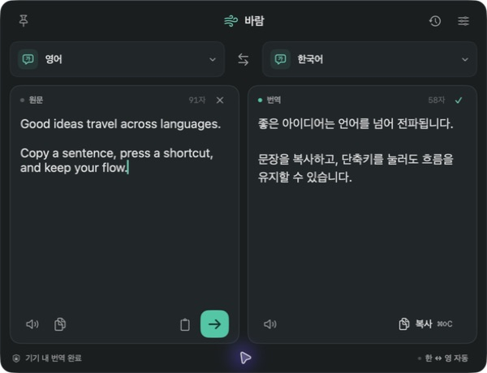

# 바람 — 메뉴 막대 번역기

Apple의 기기 내 번역을 사용하는 macOS 메뉴 막대 앱입니다. 클립보드의 글을 단축키로 번역하고, 원문과 번역문을 서식 없는 텍스트로 복사할 수 있습니다. 구독이나 API 키가 필요하지 않습니다.



## 다운로드 및 설치

**[최신 앱 다운로드](https://github.com/jooyoungho/baram/releases/latest)** — 소스를 빌드하지 않아도 됩니다.

1. 릴리즈의 **DMG 파일**을 내려받아 엽니다.
2. `Baram.app`을 옆의 **Applications** 폴더로 드래그합니다.
3. 응용 프로그램 폴더에서 **바람**을 실행합니다. 메뉴 막대에 말풍선 번역 아이콘이 생깁니다.

ZIP 파일을 사용해도 됩니다. 압축을 풀고 `Baram.app`을 응용 프로그램 폴더로 옮기세요. 업데이트할 때는 실행 중인 바람을 먼저 종료한 뒤 앱을 교체합니다.

현재 배포본은 Developer ID 서명·Apple 공증이 없는 개인용 빌드입니다. 첫 실행이 차단되면 앱 실행을 한 번 시도한 뒤 **시스템 설정 → 개인정보 보호 및 보안 → 확인 없이 열기(Open Anyway)**에서 이 앱의 실행을 허용할 수 있습니다. [Apple의 첫 실행 안내](https://support.apple.com/ko-kr/102445)를 참고하세요.

현재 빌드는 Apple Silicon 맥, macOS 26 이상을 대상으로 합니다. macOS 26.4 이상에서는 Apple의 고품질 기기 내 번역 모델을 사용합니다. 구독이나 API 키가 필요하지 않습니다. 언어 모델이 준비되지 않았다면 macOS에서 표시하는 언어 다운로드 안내를 완료하세요.

## 평소 번역할 때

1. Notion, 브라우저 등에서 텍스트를 **⌘C**로 복사합니다.
2. **⌘⇧I**를 누릅니다.
3. 바람이 열리고 클립보드 텍스트를 자동으로 붙여넣어 번역합니다.
4. 클립보드에서 가져온 **왼쪽 원문 전체가 바로 선택**됩니다. **⌘C**로 원문을 서식 없이 복사할 수 있습니다. 번역이 끝나도 선택이 오른쪽 결과로 이동하지 않습니다.

번역문 전체를 복사하려면 오른쪽 **복사** 버튼 또는 **⌘⇧C**를 사용하세요.

메뉴 막대 아이콘을 눌러 직접 입력해도 됩니다. 입력을 0.65초 멈추면 자동으로 번역합니다. **⌘Return** 또는 민트색 화살표를 누르면 바로 번역합니다.

처음에는 원문 **자동 감지**, **한 ↔ 영 자동**이 켜져 있습니다. 한국어 원문은 영어로, 영어·일본어 등 다른 언어는 한국어로 번역합니다. 오른쪽 언어를 직접 선택하면 자동 전환이 꺼지고 선택한 언어를 유지합니다. 지원 언어 목록은 이 맥의 Apple 번역에서 가져옵니다.

## 서식 없는 텍스트가 필요할 때

- **원문 그대로:** 왼쪽 원문을 원하는 만큼 선택하고 **⌘C**. 또는 왼쪽 복사 아이콘을 누르면 원문 전체를 복사합니다.
- **번역 결과:** 오른쪽 결과를 원하는 만큼 선택하고 **⌘C**. 또는 오른쪽 복사 아이콘 / **⌘⇧C**로 결과 전체를 복사합니다.
- 이후 Notion 등에 **⌘V**로 붙여넣습니다. 클립보드에는 글꼴·굵기·색상·HTML·RTF 없이 텍스트만 들어 있습니다. 줄바꿈과 공백은 보존합니다.

원문 복사는 번역 성공 여부와 상관없이 가능합니다. 별도의 서식 제거 모드를 켤 필요가 없습니다. 붙여넣는 앱이 텍스트 자체를 링크나 Markdown으로 해석하는 동작은 그 앱의 설정에 따릅니다.

## 작은 기능들

- **부드러운 팝업:** 메뉴 막대 아래에서 짧게 나타나고 사라집니다. macOS ‘동작 줄이기’ 설정을 따릅니다.
- **언어 검색:** 언어 버튼을 눌러 이름이나 언어 코드로 검색합니다. 한국어·영어·일본어를 먼저 보여줍니다.
- **복사 피드백:** 버튼 또는 단축키로 복사하면 체크 표시와 ‘복사됨’ 안내가 잠깐 나타납니다.
- **핀:** 다른 앱을 클릭해도 창을 유지합니다.
- **Esc:** 창을 닫습니다. 메뉴 막대에서 계속 실행됩니다.
- **언어 교환:** 결과를 원문으로 가져와 반대 방향으로 번역합니다.
- **듣기:** macOS 음성으로 원문이나 번역문을 읽습니다.
- **기록:** 설정에서 켜면 최근 100개를 이 맥에 저장합니다. 기본값은 꺼짐입니다.
- **창 크기:** 가장자리를 드래그해 조절하면 다음 실행에도 크기를 기억합니다.
- **종료:** 설정 화면의 ‘바람 종료’ 또는 메뉴 막대 아이콘을 오른쪽 클릭합니다.

## 단축키 바꾸기

기본값은 **⌘⇧I**이며, 각 사용자가 원하는 조합을 저장할 수 있습니다.

1. 오른쪽 위 **설정**을 엽니다.
2. **클립보드 번역 단축키**에 표시된 현재 조합을 누릅니다.
3. 사용할 키 조합을 직접 누릅니다. Command·Control·Option 중 하나 이상과 다른 키를 함께 사용하세요.

**Esc**를 누르면 변경을 취소합니다. **기본값**으로 ⌘⇧I를 복원할 수 있고, 다른 앱이 사용 중인 조합은 안내를 표시합니다. 설정은 이 맥에 저장되어 앱을 다시 켜도 유지됩니다. 손쉬운 사용이나 입력 모니터링 권한은 필요하지 않습니다.

## 데이터와 범위

번역은 Apple의 기기 내 번역 엔진에서 처리합니다. 앱은 자체 서버, 계정, 추적 코드를 사용하지 않습니다. 클립보드는 단축키나 붙여넣기 동작 때 읽으며 상시 감시하지 않습니다. 복사 버튼을 누르기 전에는 번역 결과로 클립보드를 덮어쓰지 않습니다.

선택적으로 저장한 기록: `~/Library/Application Support/Baram/history.json`.

메뉴 막대 번역, 사용자 지정 클립보드 단축키, 다국어 선택, 순수 텍스트 복사를 지원합니다. 한 번에 30,000자까지 번역할 수 있습니다.

## 소스에서 다시 빌드

Xcode 26.4 이상에서 폴더의 `Package.swift`를 열 수 있습니다. 터미널에서는:

```sh
git clone https://github.com/jooyoungho/baram.git
cd baram
./build.sh
open dist/Baram.app
swift test
```

`build.sh`는 `.build/`에서 빌드해 `dist/Baram.app`을 생성하고 로컬 실행을 위한 ad hoc 서명을 합니다. Developer ID 서명·공증 또는 App Store 배포용 서명은 포함하지 않습니다. 개발 환경은 Xcode가 활성 개발자 디렉터리로 선택되어 있어야 합니다.

빌드·출력 위치는 `BARAM_BUILD_ROOT`와 `BARAM_APP_PATH` 환경 변수로 지정할 수 있습니다. 외부 패키지 의존성은 없습니다. 빌드 산출물, 개인 설정, 번역 기록은 저장소에서 제외합니다. 실제 동작 확인 내역은 [검증 기록](검증.md)에 정리했습니다.

설치용 DMG·ZIP과 SHA-256 목록을 만들려면 `./Scripts/package-release.sh`를 실행하세요. 결과는 `dist/`에 생성되며, `BARAM_RELEASE_DIR`로 위치를 바꿀 수 있습니다.

번역 API: [Apple TranslationSession](https://developer.apple.com/documentation/translation/translationsession).
